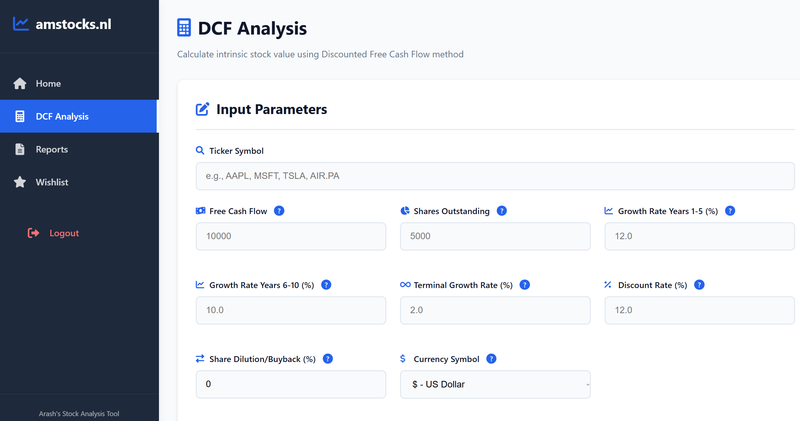
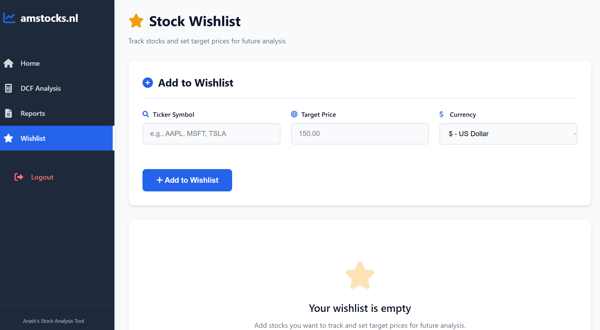
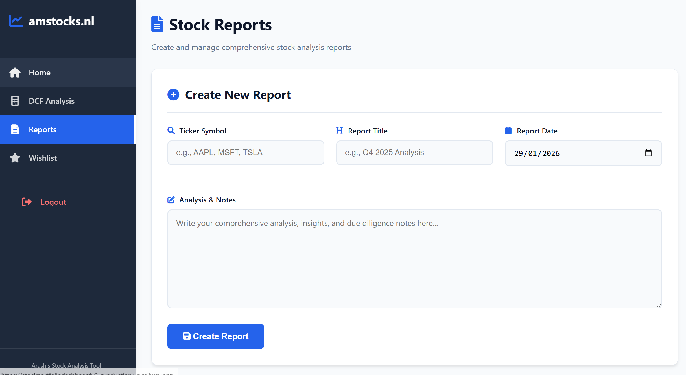
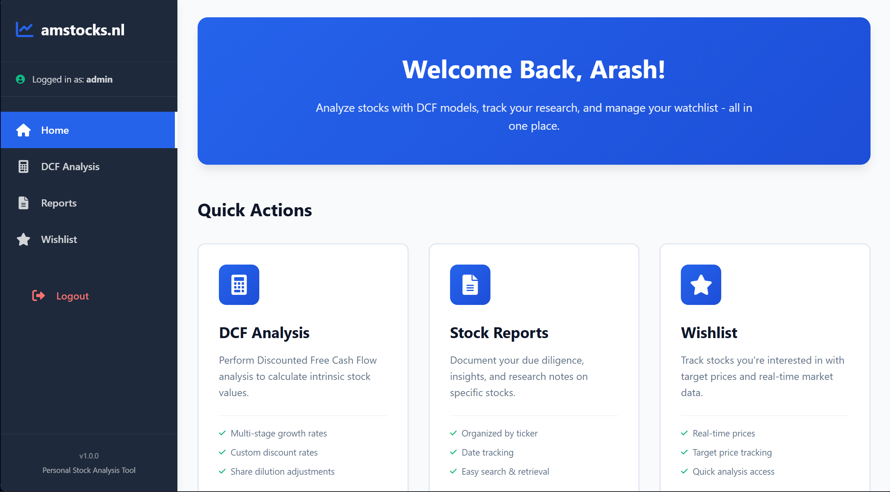

# 📊 Stock Analysis Dashboard

A comprehensive personal stock analysis tool for performing DCF valuations, tracking watchlist stocks, and managing research reports. Built for personal investment research and due diligence.

**Live at:** [amstocks.nl](https://amstocks.nl) *(Private - Authentication Required)*

---

## 🎯 Overview

This is a lightweight, personal-use web application designed to streamline stock analysis workflows. The application focuses on three core functionalities:

1. **DCF Analysis** - Calculate intrinsic stock values using the Discounted Free Cash Flow method
2. **Stock Wishlist** - Track target stocks with real-time price monitoring
3. **Research Reports** - Document comprehensive due diligence and analysis notes

---

## ✨ Features

### 📈 DCF Analysis Page
- **Advanced DCF Calculator** with 2-stage growth model
- Input parameters: FCF, shares outstanding, growth rates (1-5 yrs, 6-10 yrs), terminal growth, discount rate, share dilution
- Real-time stock price fetching via Yahoo Finance API
- Automatic margin of safety calculations
- Support for 20+ currencies (USD, EUR, GBP, JPY, CNY, etc.)
- Save & manage historical analyses
- Export analyses to Reports or Wishlist with one click



### ⭐ Stock Wishlist
- Add stocks with target prices
- Real-time current price monitoring (Yahoo Finance API)
- Multi-currency support
- Quick actions: Create Report, Delete from wishlist
- Track acquisition opportunities at desired price points



### 📝 Stock Reports
- Create comprehensive stock analysis reports
- Pre-fill reports from DCF analyses or Wishlist entries
- Edit and manage existing reports
- Track report dates and creation timestamps
- Full CRUD operations (Create, Read, Update, Delete)



### 🏠 Home Page
- Clean dashboard interface
- Quick access to all features
- User authentication with session management



---

## 🛠️ Technology Stack

### Backend
- **Flask 3.0.0** - Web framework
- **Flask-SQLAlchemy 3.1.1** - ORM for database operations
- **Flask-Login 0.6.3** - User authentication & session management
- **PostgreSQL** - Production database (Railway)
- **SQLite** - Local development database

### Frontend
- **HTML5** with Jinja2 templating
- **CSS3** with custom design system and CSS variables
- **Vanilla JavaScript** - Client-side interactivity
- **Font Awesome 6.0** - Icon library

### APIs & Libraries
- **yfinance 0.2.65** - Real-time stock price data from Yahoo Finance
- **python-dotenv 1.0.0** - Environment variable management
- **Gunicorn 21.2.0** - WSGI HTTP server for production

### Deployment
- **Railway** - Cloud platform hosting
- **Custom Domain** - amstocks.nl (via GoDaddy DNS)
- **SSL/TLS** - Automatic HTTPS encryption

---

## 🚀 Key Integrations

### Cross-Page Data Flow
- **DCF → Wishlist:** Add analyzed stocks to watchlist with intrinsic value as target price
- **DCF → Reports:** Create reports pre-filled with analysis parameters and results
- **Wishlist → Reports:** Generate reports for watchlist stocks with target price context

### Real-Time Data
- Automatic stock price fetching on page load
- Support for international exchanges (NASDAQ, NYSE, LSE, Euronext, etc.)
- Fallback handling for unavailable price data

---

## 📱 Responsive Design

- **Desktop-first** design with full mobile optimization
- **Collapsible sidebar** with hamburger menu on mobile (<768px)
- **Horizontal scrolling tables** for complex data on small screens
- **Touch-friendly** action buttons and form inputs
- Consistent UI/UX across all screen sizes

---

## 🔐 Security Features

- Secure user authentication with password hashing
- Session management with 15-minute inactivity timeout
- Environment-based configuration (development vs. production)
- SQL injection protection via ORM (SQLAlchemy)
- CSRF protection (Flask built-in)

---

## 📦 Project Structure

```
Stock_Dashboard_App_NEW_VERSION/
├── app.py                      # Main Flask application
├── requirements.txt            # Python dependencies
├── Procfile                    # Railway deployment config
├── runtime.txt                 # Python version specification
├── .env                        # Environment variables (not in repo)
├── .gitignore                  # Git ignore rules
├── dcf/
│   └── dcf_default.py         # DCF calculation logic
├── templates/
│   ├── base.html              # Base template with sidebar & modals
│   ├── home.html              # Homepage
│   ├── login.html             # Login page
│   ├── dcf.html               # DCF analysis page
│   ├── wishlist.html          # Stock wishlist page
│   ├── reports.html           # Reports listing page
│   ├── view_report.html       # Individual report view
│   ├── edit_report.html       # Report editor
│   └── sidebar.html           # Navigation sidebar
├── static/
│   ├── styles.css             # Main stylesheet (1900+ lines)
│   ├── dcf.js                 # DCF page JavaScript
│   ├── favicon.ico            # Site favicon
│   └── *.png                  # Screenshots for README
└── instance/
    └── stocks.db              # SQLite database (development)
```

---

## 💾 Database Schema

### DCFAnalysis Table
- `id` (Integer, PK)
- `ticker` (String)
- `free_cash_flow` (Float)
- `shares_outstanding` (Float)
- `growth_rate_5yr` (Float)
- `growth_rate_6_10yr` (Float)
- `terminal_growth_rate` (Float)
- `discount_rate` (Float)
- `share_dilution` (Float)
- `intrinsic_value` (Float)
- `currency` (String)
- `date_created` (DateTime)

### Report Table
- `id` (Integer, PK)
- `ticker` (String)
- `title` (String)
- `date` (DateTime)
- `notes` (Text)
- `date_created` (DateTime)

### Wishlist Table
- `id` (Integer, PK)
- `ticker` (String, Unique)
- `target_price` (Float)
- `currency` (String)
- `date_added` (DateTime)

---

## 🎨 Design Principles

- **Minimalist & Clean:** Focus on functionality without visual clutter
- **Consistent Spacing:** 8px base unit for padding/margins
- **Color System:** Primary blue (#2563eb), Success green (#10b981), Danger red (#ef4444)
- **Typography:** System font stack for native look and performance
- **Accessibility:** Proper contrast ratios, ARIA labels, keyboard navigation

---

## 📝 Future Enhancements (Potential)

- [ ] Export reports to PDF
- [ ] Email notifications when wishlist stocks hit target prices
- [ ] Portfolio performance tracking
- [ ] Advanced charting with historical data visualization
- [ ] Comparison tool for multiple DCF scenarios
- [ ] Dividend discount model (DDM) calculator
- [ ] API for programmatic access

---

## 📄 License

This is a **private, personal-use application**. Not licensed for public distribution or commercial use.

---

## 👤 Author

**Arash Mirshahi**  
- Website: [amstocks.nl](https://amstocks.nl)
- GitHub: [@Arashi20](https://github.com/Arashi20)

---

## 🙏 Acknowledgments

- **Yahoo Finance** for providing free stock market data
- **Railway** for reliable and affordable hosting
- **Flask Community** for excellent documentation and support
- **Font Awesome** for beautiful icons

---

*Last Updated: January 2026*